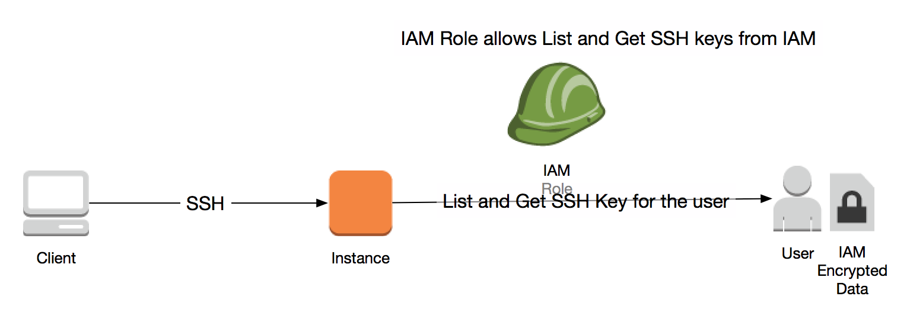
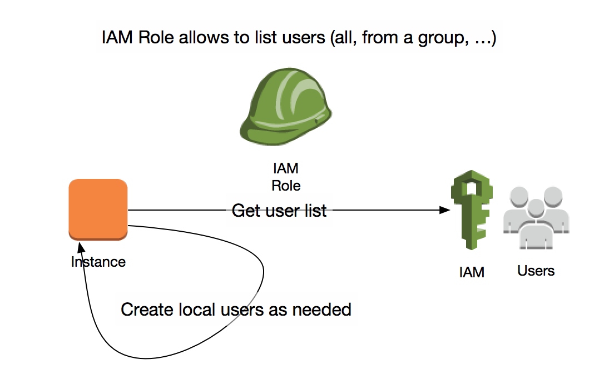
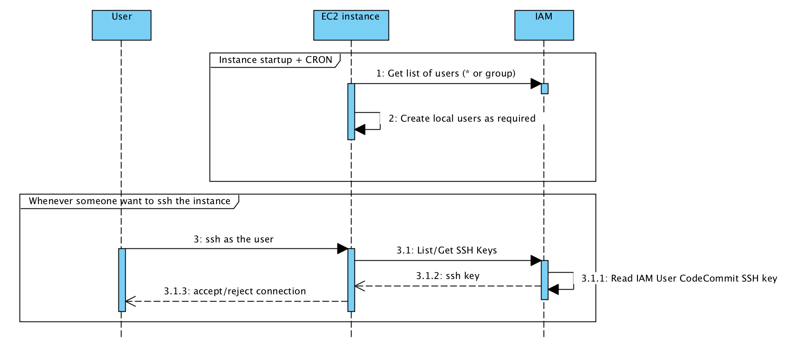

# User-specific SSH keys management for EC2 instances with Terraform provisioning

By default, AWS EC2 let you connect to your instances using the EC2 key pair defined when created this instance. 
Managing this key, sharing it across your users who need ssh access, correctly revoking access whenever required, requires some work. 
These samples will show you an easy way to synchronize IAM users with instances users, and will use CodeCommit ssh keys to authenticate the users when the try to ssh the instance. 

Usually, 1 keypair is defined for each EC2 region and associated to your instance that you can use with a ec2-user (or other used for different AMIs)
With this setup: no longer mandatory to have region-defined key (but you could), and automatic sync of users from IAM, each one with their own ssh-keys.

_Note_: there's a lot of duplication across the samples, because we want each sample to be self-sufficient (you can take the one you like and throw out the others)

## What's in there

Each of of the subfolders provides a standalone implementation. All use the same logic, with little added details here and there.
All these solutions comes as a Terraform solution, with a Makefile to get a simple plan/apply syntax without having to bother with extra arguments.

- `ec2_*` folders provision an ec2 ECS optimized AMI
- `*_simple_*` folders provision the bare minimum: 
    - An EC2 instance
    - IAM role and profile used by the instance 
    - A security group to setup basic network rules or the instance
- `*_vpc_*` folders provision an ec2 instance in a VPC
    - An EC2 instance
    - IAM role and profile used by the instance 
    - A security group to setup basic network rules or the instance
    - A VPC
    - The internet gateway, subnet, route table for the VPC 
- `*_nokey` folders are variations of the same where the ec2 keypair isn't required to provision the host: only user-data is used to pull the setup information from Git when he instance is bootstrapped.
   
   
If you want to get a quick view, you'd better start with `ec2_simple` which is the straightfoward way to do it.
If you later want to remove need of the ssh key to provision the instance, move on to `ec2_simple_nokey`
The VPC versions will help you to get started with a VPC (kep simple here, with a single instance in a single availability zone)

Finally, `ec2_vpc_nokey` uses maps to set the AMI and the availibity zone, depending on the region you set in your variables. 

If you're new into Terraform and HCL, the same progression applies: it will be easier to get started with the simplest version (`ec2_simple`, to later only focus on the changes and additon... rather than trying to get everything at once)

### What's the goal of this setup?

These are slightly different ways to setup your instance, but they all achieve the same setup to later let a user ssh the instance.
The process is twofolds:

- at regular interval, the instance will update the local sudoers, getting a list of users (without any key) and create them on the host if they're new

- whenever a user ssh the instance, the key will be looked for in his IAM CodeCommit config.

Which can be viewed as:

## Quick note about IAM Roles and Profiles

One of the constraints shown here is that an EC2 instance can have 1 profile, with a single role. So you can't have a few roles and bundle them in that profile, you have ot put everything together there. (But that role can be used by many instances)

Detail about the EC2 IAM restriction: Roles in an instance profile: 1 (each instance profile can contain only 1 role)

## Set it up

After initial cloning/downloading, you need to setup your secrets.
Enter the folder of the solution you want to try, then prepare your secret file with

    cp secret.sample.fvars secret.tfvars
    vi secret.tfvars

Then open and edit `secret.tfvars` to enter your real secrets (aws credentials, and for some samples the desired region).
These secrets will be used by Terraform 
- to be abel to perform AWS commands on your behalf.
- to customize some variable depending on your own variables (region, ...)

It doesn't need to be your own user's credentials. 
At the end of the day, the IAM users you use will need all the privileges to perform all the resources creation we do in this terraform plan. You can create and use any CI user to do this.

## Dry-run / plan

    make plan

Terraform will do a dry-run and save it as an execution plan. It will tell you everything that is going to be created/edited/destroyed, but no change will be done in your infrastructure.

## Create/update your stack

    make apply

Terraform is going to create all the resources... If your secrets are corrcet and if you have enough privileges, you should get the ip of the instance at the end (otherwise you'll see some detailed error report)

## Test it

The public IP/DNS of your instance is shown in Terraform outputs. In the following snippet, `awsUsername` contains the name of your AWS IAM user (if you need to specify the ssh key, use `-i path/to/your/key` like for any ssh connection)

    ec2PublicIp=$(terraform output | grep 'ec2_instance_public_ip' | sed 's@.*= @@g')
    awsUsername=$(aws iam get-user  | jq -r .User.UserName)
    ssh ${awsUsername}@${ec2PublicIp}

## Clean it

You might already guessed it, but destroying all the resources you created to run this sample is as simple as 

    make destroy
    
If you change it to use ElasticIP, you might need to call it several times, because of timeouts during elastic ip cleanup. 

## Where to go from here

These samples should help getting you started. Then you'd probably want to look into these to make your solution more robust abd better meet your specific needs.

### Simpler storage of ssh sync scripts

To keep these samples simple, everything is in there. In the real world, you'd probably want to keep your Terraform projects in your private source control system, and to make the ssh sync scripts used easy to fetch securely form the instance (ie maybe not from the VCS). 
An easy solution, for simple project, is a dedicated public repo, as long as there's no specific information about your infrastructure, it could be fine and it's very easy. You can browse for inspiration in the [aws-ec2-ssh-sync-samples](https://github.com/sportebois/aws-ec2-ssh-sync-samples) repo.
Other use cases could leverage S3, since the secure access would be resolved by the IAM role associated with the instance profile of your instance, and therefore no specific credentials would need to be added.

### Smaller list of users

To only sync a subset of users, you can update `aws iam list-users ...` in  the `import_users.sh` script to fetch only the users who should access this instance. 
For instance, the following command will only get the users who belong to the `App01` group. Only those will be able to ssh the instance:
    `aws iam get-group --group-name Admins --query "Users[].[UserName]" --output text`

This is a starting point, you now have some foundation set on which to build the solution that best matches your use-case. 

### Better networking

In order to reduce the scope of these sample, networking was limited to the bare minimum.
From the ssh point of view, implementing a bastion in the public subnet of the VPC, which would then let your access the private subnet where your other hosts live would be something you'd like to look into.

### Other improvements

- Add CloudTrail logging for IAM activity
- Investigate KMS-based solution to store and fetch keys

## Credits

All the hard work has been done by Michael Wittig, and his presentation of the 'hack' to use CodeCommit's ssh keys or EC2 instances is brilliant. 
Go read [Manage AWS EC2 SSH access with IAM](https://cloudonaut.io/manage-aws-ec2-ssh-access-with-iam/) to learn more.
This repo started as doing a port using the same technique with Terraform, because we'd prefer to use Terraform than CloudFormation. Then some variations were added to illustrate different techniques. 

## Want to learn more?

If you're new to Terraform but want to learn more, [The Terraform Book](https://terraformbook.com) offers a free preview, and is a great intro to this thing. You'll get the basics to then read the official documentation (which is great, but maybe not as much newcomer-friendly) 

## TODO / next steps

- Basic arch diagram to make this easier to get at first glance
- do a clean variation using CoreOS
- do bastion/nat/multipleAZ variations? 
 